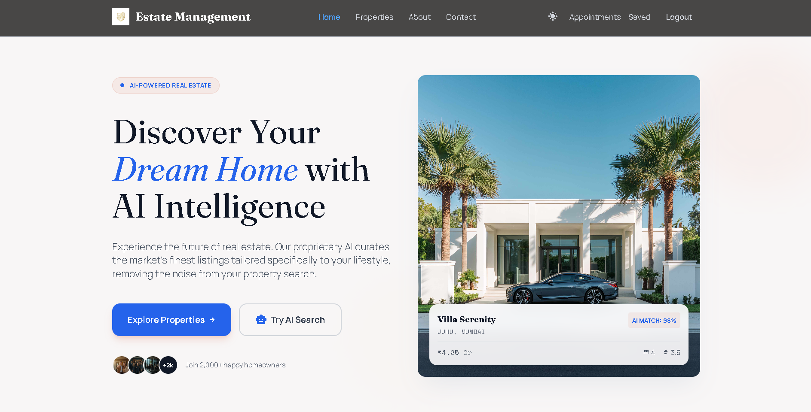
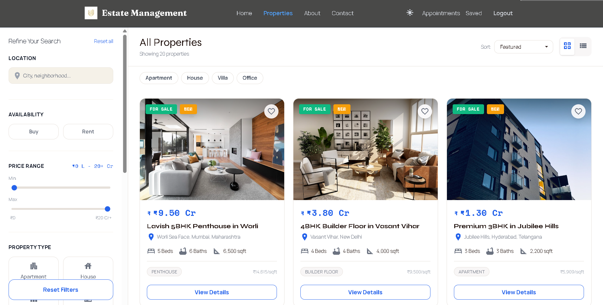

# BuildEstate — Real Estate Management System

A full-stack real estate platform built with React, Node.js, and MongoDB. Supports property listings, appointment scheduling, user authentication, and a separate admin dashboard.

---

## Table of Contents

- [Overview](#overview)
- [Features](#features)
- [Tech Stack](#tech-stack)
- [Project Structure](#project-structure)
- [Getting Started](#getting-started)
- [Environment Variables](#environment-variables)
- [API Reference](#api-reference)
- [Screenshots](#screenshots)

---

## Overview

BuildEstate is a property listing and management platform focused on the Indian real estate market, with primary coverage in Bengaluru and other major metro cities. It provides separate experiences for buyers, sellers, and administrators.

The platform runs as three services from a single monorepo:

| Service | Port | Description |
|---|---|---|
| Backend API | 4000 | Express.js REST API |
| Frontend | 5173 | Buyer/seller React app |
| Admin Panel | 5174 | Admin-only React dashboard |

---

## Features

### Property Browsing
- Filter sidebar with location, property type, price range, bedrooms, bathrooms, and amenities
- Grid and list view modes with animated card transitions
- "New" badge on properties listed in the last 45 days
- Price per sqft on every card
- Recently viewed properties strip (localStorage)
- Property type quick-filter chips

### Property Details
- Schedule a viewing form (guest and authenticated)
- Interactive EMI calculator (down payment %, interest rate, loan tenure)
- Share property — copies URL to clipboard
- Similar properties section (same city)
- Scroll progress indicator

### Authentication
- JWT-based login and registration
- Forgot password / reset password via email
- Role-based access: buyer, seller, admin

### Seller Tools
- Add and edit property listings with image upload
- View and respond to incoming viewing requests
- Separate "My Listings" page

### Admin Dashboard
- Property CRUD with image upload
- Appointment management with status updates
- User management
- Platform analytics

### Contact
- Location: Bengaluru, Karnataka
- Character-limited contact form (500 chars) with live counter

---

## Tech Stack

**Frontend**
- React 18, TypeScript, Vite 6
- Tailwind CSS v4
- Framer Motion
- React Router v7
- Axios

**Backend**
- Node.js, Express.js
- MongoDB with Mongoose
- JWT authentication
- bcryptjs
- Nodemailer (Brevo SMTP)
- Multer + ImageKit for image uploads

---

## Project Structure

```
buildestate/
├── backend/
│   ├── config/             # MongoDB, ImageKit, email config
│   ├── controller/         # Route handlers
│   ├── middleware/         # JWT auth, file uploads, rate limiting
│   ├── models/             # Mongoose schemas
│   ├── routes/             # Express route files
│   ├── scripts/
│   │   ├── createAdmin.js  # Create/reset admin account
│   │   └── seedAll.js      # Seed demo properties and users
│   └── server.js
│
├── frontend/
│   └── src/
│       ├── components/     # UI components (Navbar, Footer, PropertyCard, etc.)
│       ├── contexts/       # AuthContext
│       ├── hooks/          # useSEO, useRecentlyViewed
│       ├── pages/          # Route-level page components
│       ├── services/       # api.ts — Axios instance + all API calls
│       └── utils/          # formatPrice.ts
│
└── admin/
    └── src/
        ├── components/     # Login, Navbar, ProtectedRoute
        ├── pages/          # Dashboard, Add, List, Update, Appointments
        └── contexts/       # Admin AuthContext
```

---

## Getting Started

### Prerequisites

- Node.js 18 or later
- MongoDB (local or Atlas)

### Setup

```bash
git clone https://github.com/mikey-harsh/Real-Estate-Management-System.git
cd Real-Estate-Management-System
npm install
```

Copy environment files and fill in your values:

```bash
cp backend/.env.local.example backend/.env.local
```

Start all three services:

```bash
npm run dev
```

### Create Admin Account

```bash
cd backend
node scripts/createAdmin.js
```

Login at `http://localhost:5174` with the credentials set in `ADMIN_EMAIL` and `ADMIN_PASSWORD`.

### Seed Demo Data

```bash
cd backend
node scripts/seedAll.js --force
```

Inserts 28 demo properties and 5 sample users.

---

## Environment Variables

### Backend — `backend/.env.local`

```env
PORT=4000
NODE_ENV=development
MONGO_URI=mongodb://localhost:27017/buildestate
JWT_SECRET=your_jwt_secret
ADMIN_EMAIL=admin@buildestate.com
ADMIN_PASSWORD=YourSecurePassword
SMTP_USER=your_smtp_login
SMTP_PASS=your_smtp_password
EMAIL=your_sender_email
WEBSITE_URL=http://localhost:5173
FRONTEND_URL=http://localhost:5173
ADMIN_URL=http://localhost:5174
IMAGEKIT_PUBLIC_KEY=public_xxxxx
IMAGEKIT_PRIVATE_KEY=private_xxxxx
IMAGEKIT_URL_ENDPOINT=https://ik.imagekit.io/your_id
```

### Frontend — `frontend/.env.local`

```env
VITE_API_BASE_URL=http://localhost:4000
```

### Admin — `admin/.env.local`

```env
VITE_BACKEND_URL=http://localhost:4000
```

---

## API Reference

### Authentication

| Method | Endpoint | Description |
|---|---|---|
| POST | /api/users/register | Create new user account |
| POST | /api/users/login | Login, returns JWT |
| POST | /api/users/admin | Admin login |
| GET | /api/users/me | Get current user (JWT required) |
| POST | /api/users/forgot | Send password reset email |
| POST | /api/users/reset/:token | Reset password |

### Properties

| Method | Endpoint | Description |
|---|---|---|
| GET | /api/products/list | Paginated property list |
| GET | /api/products/single/:id | Get property by ID |
| POST | /api/products/add | Add new property (admin) |
| POST | /api/products/update | Update property (admin) |
| POST | /api/products/remove | Delete property (admin) |

### Appointments

| Method | Endpoint | Description |
|---|---|---|
| POST | /api/appointments/schedule | Book a viewing (guest) |
| POST | /api/appointments/schedule/auth | Book a viewing (logged in) |
| GET | /api/appointments/user | Get appointments by email |
| PUT | /api/appointments/cancel/:id | Cancel appointment |
| GET | /api/appointments/all | All appointments (admin) |
| PUT | /api/appointments/status | Update appointment status (admin) |

### Other

| Method | Endpoint | Description |
|---|---|---|
| POST | /api/forms/submit | Contact form submission |
| GET | /api/health | Health check |

---

## Screenshots

### Homepage



### Property Listings



---

## Contributors

| GitHub | Role |
|---|---|
| [mikey-harsh](https://github.com/mikey-harsh) | Full Stack Development |
| [hariish18](https://github.com/hariish18) | Frontend Development |
| [Dawar54](https://github.com/Dawar54) | Backend Development |

---

## Contact

**Location:** Bengaluru, Karnataka

**Phone:** +91 XXXXXX889

**Email:** CBA.Teach.Team2@gmail.com
