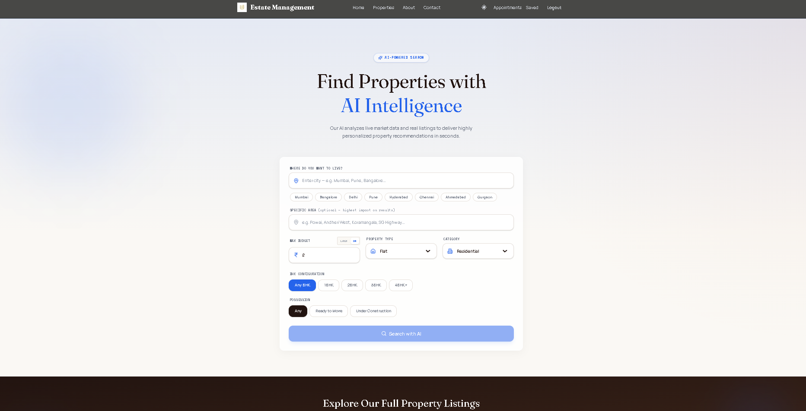
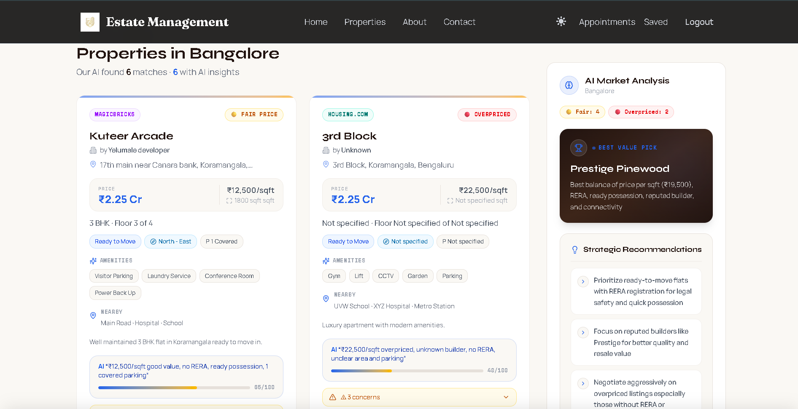

# Estate Management — Real Estate Management System

A full-stack real estate platform built with React, Node.js, and MongoDB. Supports property listings, appointment scheduling, user authentication, a separate admin dashboard, and an **AI Property Hub** powered by GitHub Models (GPT-4o) and Firecrawl for natural-language property search and live market trend analysis.

---

## Table of Contents

- [Overview](#overview)
- [Features](#features)
- [Tech Stack](#tech-stack)
- [Project Structure](#project-structure)
- [Getting Started](#getting-started)
- [Environment Variables](#environment-variables)
- [API Reference](#api-reference)
- [Screenshots](#screenshots)
- [Contributors](#contributors)

---

## Overview

Estate Management is a property listing and management platform focused on the Indian real estate market, with primary coverage in Bengaluru and other major metro cities. It provides separate experiences for buyers, sellers, and administrators, and includes an AI-powered search module that scrapes live listings and generates market intelligence on demand.

The platform runs as three services from a single monorepo:

| Service | Port | Description |
|---|---|---|
| Backend API | 4000 | Express.js REST API |
| Frontend | 5173 | Buyer/seller React app |
| Admin Panel | 5174 | Admin-only React dashboard |

---

## Features

### Property Browsing
- Filter sidebar with location, property type, price range, bedrooms, bathrooms, and amenities
- Grid and list view modes with animated card transitions
- "New" badge on properties listed in the last 45 days
- Price per sqft on every card
- Recently viewed properties strip (localStorage)
- Property type quick-filter chips
- Active filter count badge with clear-all action

### Property Details
- Multi-image gallery with full-screen view
- Scroll progress indicator bar
- Interactive EMI calculator (down payment %, interest rate, loan tenure)
- Share property — copies URL to clipboard
- Similar properties section (same city)
- Estimated reading time on description

### AI Property Hub
- **Natural-language search** — describe city, locality, BHK, budget, and possession; GPT-4o interprets intent and returns ranked, AI-summarised results scraped live from the web
- **Location trend analysis** — enter any city to get a structured market brief: price momentum, supply/demand signals, infrastructure news, and investment outlook
- **No browser setup required** — API keys are resolved from backend environment variables; users can optionally override with personal keys stored in localStorage
- Rate-limited at 10 requests per hour per IP to prevent abuse

### Authentication
- JWT-based login and registration
- Email verification on sign-up
- Forgot password / reset password via email (Brevo SMTP)
- Role-based access: buyer, seller, admin
- Session persistence across browser tabs

### Seller Tools
- Add and edit property listings with ImageKit image upload
- View and respond to incoming viewing requests
- Separate "My Listings" page with edit/delete controls
- Auto-expire listings after possession date (cron job)

### Admin Dashboard
- Property CRUD with image upload
- Approve / reject pending listings
- Appointment management with status updates
- User management and suspension controls
- Platform-wide analytics

### Contact & Forms
- Character-limited contact form (500 chars) with live counter
- Brevo transactional email on form submission

---

## Tech Stack

**Frontend**
- React 18, TypeScript, Vite 6
- Tailwind CSS v4
- Framer Motion
- React Router v7
- Axios, Recharts

**Backend**
- Node.js, Express.js
- MongoDB with Mongoose
- JWT authentication, bcryptjs
- Nodemailer (Brevo SMTP)
- Multer + ImageKit for image uploads
- Helmet, express-rate-limit, express-mongo-sanitize
- Winston logging, node-cron

**AI Services**
- GitHub Models API — GPT-4o for property search and market trend summaries
- Firecrawl — live web scraping of real estate listings

---

## Project Structure

```
estate-management/
├── backend/
│   ├── config/             # MongoDB, ImageKit, email config
│   ├── controller/         # Route handlers (incl. AI search)
│   ├── middleware/         # JWT auth, file uploads, rate limiting
│   ├── models/             # Mongoose schemas
│   ├── routes/             # Express route files
│   ├── scripts/
│   │   ├── createAdmin.js  # Create/reset admin account
│   │   └── seedAll.js      # Seed demo properties and users
│   └── server.js
│
├── frontend/
│   └── src/
│       ├── components/
│       │   └── ai-hub/     # AIHeroSection, ResultsGrid, TrendsPanel
│       ├── contexts/       # AuthContext
│       ├── hooks/          # useSEO, useRecentlyViewed
│       ├── pages/          # Route-level pages (incl. AIPropertyHubPage)
│       ├── services/       # api.ts — Axios instance + all API calls
│       └── utils/          # formatPrice.ts
│
└── admin/
    └── src/
        ├── components/     # Login, Navbar, ProtectedRoute
        ├── pages/          # Dashboard, Add, List, Update, Appointments
        └── contexts/       # Admin AuthContext
```

---

## Getting Started

### Prerequisites

- Node.js 18 or later
- MongoDB (local or Atlas)
- GitHub Models API key (`ghp_` prefix) — [get one here](https://github.com/marketplace/models)
- Firecrawl API key (`fc-` prefix) — [get one here](https://firecrawl.dev)

### Setup

```bash
git clone https://github.com/mikey-harsh/Real-Estate-Management-System.git
cd Real-Estate-Management-System
npm install
```

Copy the environment file and fill in your values:

```bash
cp backend/.env.example backend/.env
```

Start all three services:

```bash
npm run dev
```

### Create Admin Account

```bash
cd backend
node scripts/createAdmin.js
```

Login at `http://localhost:5174` with the credentials set in `ADMIN_EMAIL` and `ADMIN_PASSWORD`.

### Seed Demo Data

```bash
cd backend
node scripts/seedAll.js --force
```

Inserts 28 demo properties and 5 sample users.

---

## Environment Variables

### Backend — `backend/.env`

```env
PORT=4000
NODE_ENV=development
MONGO_URI=mongodb://localhost:27017/buildestate
JWT_SECRET=your_jwt_secret

# Admin credentials
ADMIN_EMAIL=admin@estatemanagement.com
ADMIN_PASSWORD=YourSecurePassword

# Email (Brevo SMTP)
SMTP_USER=your_smtp_login
SMTP_PASS=your_smtp_password
EMAIL=your_sender_email

# Frontend URLs (CORS)
WEBSITE_URL=http://localhost:5173
FRONTEND_URL=http://localhost:5173
ADMIN_URL=http://localhost:5174
LOCAL_URLS=http://localhost:5173,http://localhost:5174

# Image storage
IMAGEKIT_PUBLIC_KEY=public_xxxxx
IMAGEKIT_PRIVATE_KEY=private_xxxxx
IMAGEKIT_URL_ENDPOINT=https://ik.imagekit.io/your_id

# AI Services — required for AI Property Hub
GITHUB_MODELS_API_KEY=ghp_your_github_models_key
FIRECRAWL_API_KEY=fc-your_firecrawl_key
```

> **Note:** If `GITHUB_MODELS_API_KEY` and `FIRECRAWL_API_KEY` are set here, the AI Property Hub works for all users without any browser-side configuration. Users can optionally supply their own keys via the key modal in the UI.

### Frontend — `frontend/.env.local`

```env
VITE_API_BASE_URL=http://localhost:4000
VITE_ENABLE_AI_HUB=true
```

### Admin — `admin/.env.local`

```env
VITE_BACKEND_URL=http://localhost:4000
```

---

## API Reference

### Authentication

| Method | Endpoint | Description |
|---|---|---|
| POST | /api/users/register | Create new user account |
| POST | /api/users/login | Login, returns JWT |
| POST | /api/users/admin | Admin login |
| GET | /api/users/me | Get current user (JWT required) |
| POST | /api/users/forgot | Send password reset email |
| POST | /api/users/reset/:token | Reset password |

### Properties

| Method | Endpoint | Description |
|---|---|---|
| GET | /api/products/list | Paginated property list |
| GET | /api/products/single/:id | Get property by ID |
| POST | /api/products/add | Add new property (admin) |
| POST | /api/products/update | Update property (admin) |
| POST | /api/products/remove | Delete property (admin) |

### AI Property Hub

| Method | Endpoint | Description |
|---|---|---|
| POST | /api/properties/search | AI-powered property search (GPT-4o + Firecrawl) |
| GET | /api/properties/trends/:city | Live market trend analysis for a city |
| POST | /api/properties/validate-keys | Validate GitHub Models + Firecrawl API keys |

API keys are read from `X-Github-Key` and `X-Firecrawl-Key` request headers. If headers are absent, the backend falls back to `GITHUB_MODELS_API_KEY` and `FIRECRAWL_API_KEY` environment variables.

### Appointments

| Method | Endpoint | Description |
|---|---|---|
| POST | /api/appointments/schedule | Book a viewing (guest) |
| POST | /api/appointments/schedule/auth | Book a viewing (logged in) |
| GET | /api/appointments/user | Get appointments by email |
| PUT | /api/appointments/cancel/:id | Cancel appointment |
| GET | /api/appointments/all | All appointments (admin) |
| PUT | /api/appointments/status | Update appointment status (admin) |

### Other

| Method | Endpoint | Description |
|---|---|---|
| POST | /api/forms/submit | Contact form submission |
| GET | /api/health | Health check |

---

## Screenshots

### Homepage


### Property Listings


### AI Property Hub — Search



### AI Property Hub — Results



---

## Contributors

| GitHub | Role |
|---|---|
| [mikey-harsh](https://github.com/mikey-harsh) | Full Stack Development |
| [hariish18](https://github.com/hariish18) | Frontend Development |
| [Dawar54](https://github.com/Dawar54) | Backend Development |
| [HEDharanGowda](https://github.com/HEDharanGowda) | Full Stack Development |

---

## Contact

**Location:** Bengaluru, Karnataka

**Email:** CBA.Teach.Team2@gmail.com
